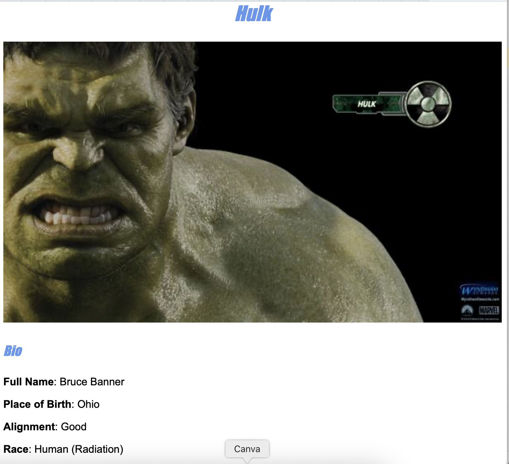

# 🦸 Avengers Information App

A beginner-friendly HTML and CSS app that displays detailed stats and descriptions for each Avenger. Built as part of my front-end learning journey.

## 🛠️ Tech Stack

- HTML
- CSS

## 🎯 Features

- Responsive design for mobile and desktop
- Clean layout using CSS Grid or Flexbox
- Avenger cards with names, images, powers, and stats

## 🚀 Live Demo

👉 [View Live Site](https://helpful-faun-941db5.netlify.app)  

## 📸 Screenshot

  

## 🧠 What I Learned

- How to structure a multi-section HTML page
- CSS techniques for layout and styling
- Improving accessibility and responsiveness

## ✍️ Author

**Tshepo Kubeka**  
[GitHub Profile](https://github.com/TshepoKubeka)
